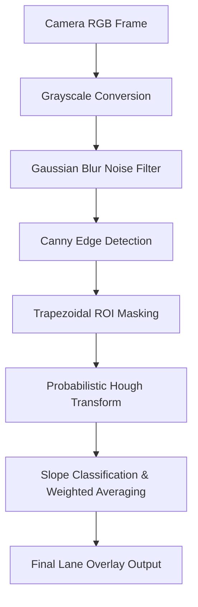

# Real-Time Road Lane Detection for Autonomous Driving

A high-performance, interactive computer vision application built with **Python**, **OpenCV**, and **Streamlit** to detect road lane markers from live camera feeds or driving video files. 

Autonomous vehicles require continuous lane identification to maintain centration, manage lane-keeping assistance systems (LKAS), and plan navigation paths. This project demonstrates how the classical edge-based lane boundary detection pipeline functions and provides a real-time, interactive environment to tune parameters visually.

---

## 🚀 Key Features

*   **Interactive Visual Tuning**: Tweak parameters like Gaussian blur kernel, Canny hysteresis limits, Region of Interest (ROI) boundaries, and Hough Transform variables from a sidebar and immediately see the results.
*   **Step-by-Step Inspection**: Tabs explaining and rendering each step of the pipeline (Original $\rightarrow$ Grayscale $\rightarrow$ Gaussian Blur $\rightarrow$ Canny Edges $\rightarrow$ ROI Mask $\rightarrow$ Hough Space Lines $\rightarrow$ Averaged Lane Overlay).
*   **Video Processing Pipeline**: Upload your own `.mp4`, `.mov`, or `.avi` files, process them frame-by-frame with the tuned parameters, track progress with a progress bar, and download the finished product with lanes overlaid.
*   **Default Dataset**: Automatic download and inclusion of the standard Udacity Self-Driving Car project video (`solidWhiteRight.mp4`) as a ready-to-test dataset.

---

## 🛠️ The Pipeline Architecture

The detection pipeline consists of 7 sequential stages:



1.  **Grayscale Conversion**: Reduces calculations from 3-channel color to a single intensity channel, saving processing power.
2.  **Gaussian Smoothing**: Eliminates camera noise and spurious details by convolving with a Gaussian kernel.
3.  **Canny Edge Detection**: Calculates gradient vector intensities in all directions. Applies two thresholds (low and high) to filter and link contours.
4.  **Region of Interest Selection**: Projects a trapezoidal polygon mask representing the perspective of the road ahead, ignoring background objects like the sky, side barriers, and trees.
5.  **Probabilistic Hough Line Transform**: Converts edge coordinates into a parameter space where straight lines are resolved using intersection voting.
6.  **Slope Classification & Filtering**: Segregates lines into left lanes (negative slopes in pixel coordinates) and right lanes (positive slopes). Filter out horizontal/vertical lines.
7.  **Weighted Average & Extrapolation**: Computes average slopes and intercepts weighted by line segment lengths, and draws unified, continuous boundary markings on top of the original video.

---

## 📦 Installation & Setup

Ensure you have Python 3.8+ installed. Follow these steps:

### 1. Clone the repository
```bash
git clone <your-repository-url>
cd "Real Time Road Lane Detection"
```

### 2. Create and activate a Virtual Environment
**On macOS/Linux:**
```bash
python3 -m venv venv
source venv/bin/activate
```
**On Windows:**
```bash
python -m venv venv
venv\Scripts\activate
```

### 3. Install Dependencies
```bash
pip install -r requirements.txt
```

### 4. Run the Application
```bash
streamlit run app.py
```
This will launch the application in your default web browser (typically at `http://localhost:8501`).

---

## ☁️ Deployment

### 🖥️ Pushing to GitHub
To push this project to your GitHub repository:
1. Create a new empty repository on your GitHub account.
2. Run the following commands in the project directory:
```bash
git init
git add .
git commit -m "Initial commit of Real-Time Road Lane Detection app"
git branch -M main
git remote add origin <YOUR_GITHUB_REPOSITORY_URL>
git push -u origin main
```

### 🚀 Deploying to Streamlit Community Cloud
Once pushed to GitHub, you can host the application for free on **Streamlit Community Cloud**:
1. Go to [share.streamlit.io](https://share.streamlit.io/) and log in with your GitHub account.
2. Click **New app**.
3. Select your repository, branch (`main`), and main file path (`app.py`).
4. Click **Deploy!** Your app will be live on the web in minutes.
